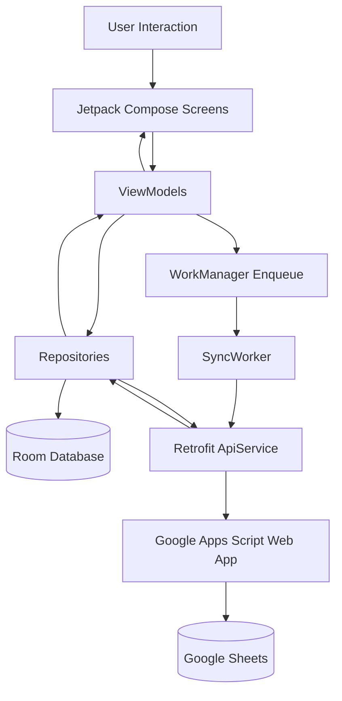
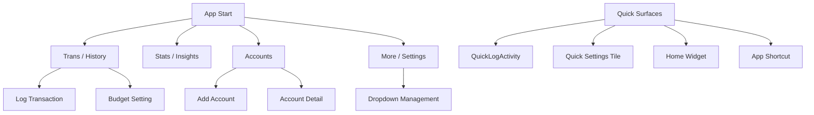
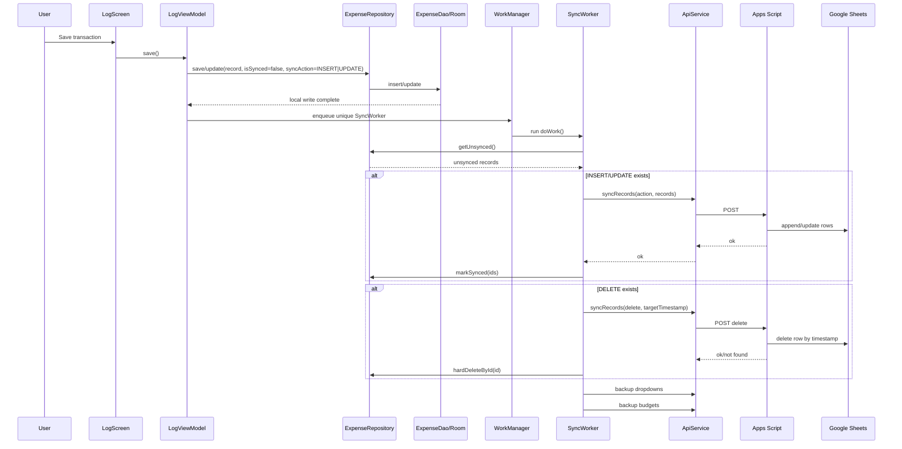
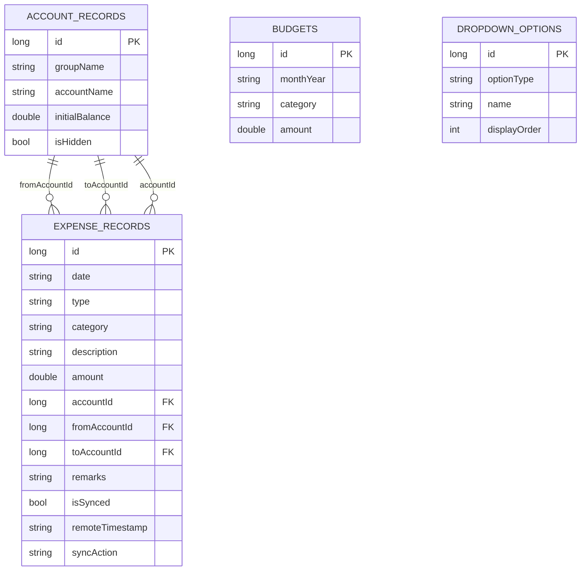
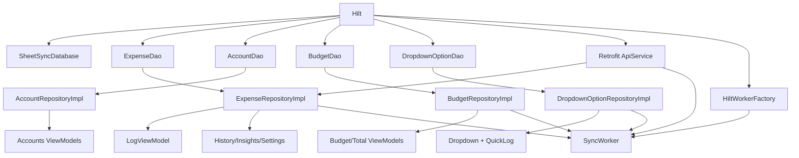

# SheetSync Architecture

This document describes the current architecture of the application, including module boundaries, runtime flows, sync behavior, and the Room database model.

## 1. High-Level Architecture

SheetSync follows an offline-first architecture:

- UI writes to local Room database immediately.
- ViewModels observe Room-backed Flows/StateFlows for reactive UI.
- WorkManager performs background synchronization to Google Apps Script.
- Google Apps Script persists/reads from Google Sheets.

## 2. Layer Responsibilities

### Presentation Layer

- Built with Jetpack Compose + Navigation.
- Primary top-level destinations:
  - Trans (History: Daily, Calendar, Monthly, Total)
  - Stats (Insights)
  - Accounts
  - More (Settings)
- Form-heavy flows are managed in ViewModels with reactive state.

### Domain/Application Layer (Repository contracts)

- Repository interfaces abstract data operations.
- ViewModels depend on repositories, not DAOs.
- Business logic examples:
  - Duplicate detection during import
  - Budget aggregation and progress computation
  - Account running-balance calculations

### Data Layer

- Room as source of truth for:
  - expense_records
  - account_records
  - budgets
  - dropdown_options
- Retrofit handles:
  - Transaction sync (insert/update/delete)
  - Transaction import
  - Dropdown import
  - Budget import

### Background Execution

- WorkManager + Hilt-injected SyncWorker.
- SyncWorker sends local unsynced records and then backs up dropdowns and budgets.
- Worker uses retry semantics on failure.

## 3. Navigation Architecture

## 4. Transaction Lifecycle

## 5. Import Flows

### Google Sheets Import

1. Settings triggers importFromSheets.
2. Repository imports dropdowns and overwrites local options.
3. Repository imports budgets and overwrites local budget rows.
4. Repository imports transactions and deduplicates against local comparable fields.

### CSV Import

1. Settings picks CSV file.
2. CsvParser parses header-based columns.
3. Records inserted via repository.
4. Optional duplicate skipping based on toggle.

## 6. Database Model (Room)

## 7. Table-Level Details

### expense_records

- Purpose: transaction ledger and sync state tracking.
- Important behavior:
  - Soft delete for sync by setting syncAction=DELETE.
  - Hard delete after successful remote delete.
  - isSynced + syncAction drives worker behavior.

### account_records

- Purpose: logical accounts for transfer and balance calculations.
- Used by:
  - Account listing and detail statement screens.
  - Transfer transactions (fromAccountId/toAccountId).

### budgets

- Purpose: monthly budget configuration.
- Unique index: (monthYear, category).
- Includes both category-level entries and total-budget semantics from app logic.

### dropdown_options

- Purpose: configurable app dictionaries.
- optionType values currently cover:
  - EXPENSE_CATEGORY
  - INCOME_CATEGORY
  - ACCOUNT_GROUP
  - PAYMENT_MODE

## 8. Dependency Injection Graph (Conceptual)

## 9. Operational Notes

- The app is intentionally resilient to intermittent connectivity due to local-first persistence + queued sync.
- Remote endpoint changes (Apps Script redeploy) require local `APPS_SCRIPT_URL` update.
- Sync includes not only transactions but also dropdown and budget backup to support restore scenarios.
