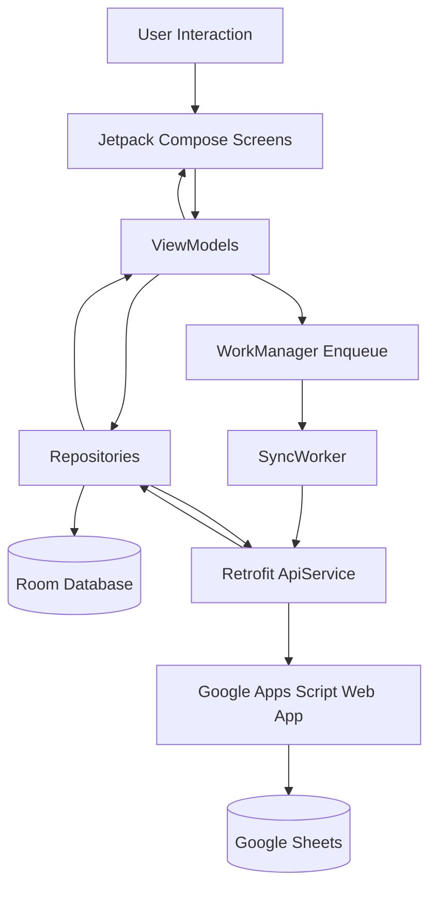
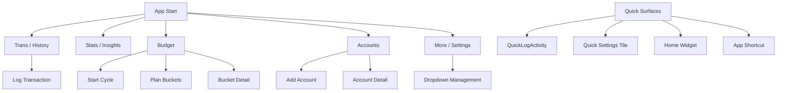
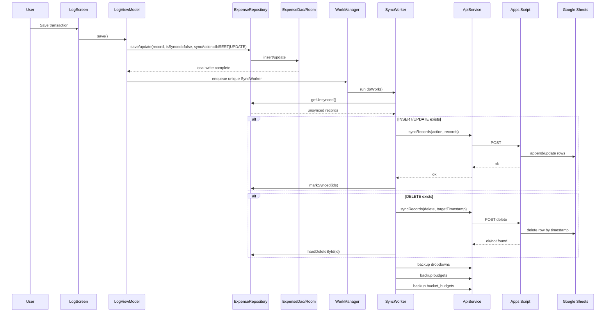
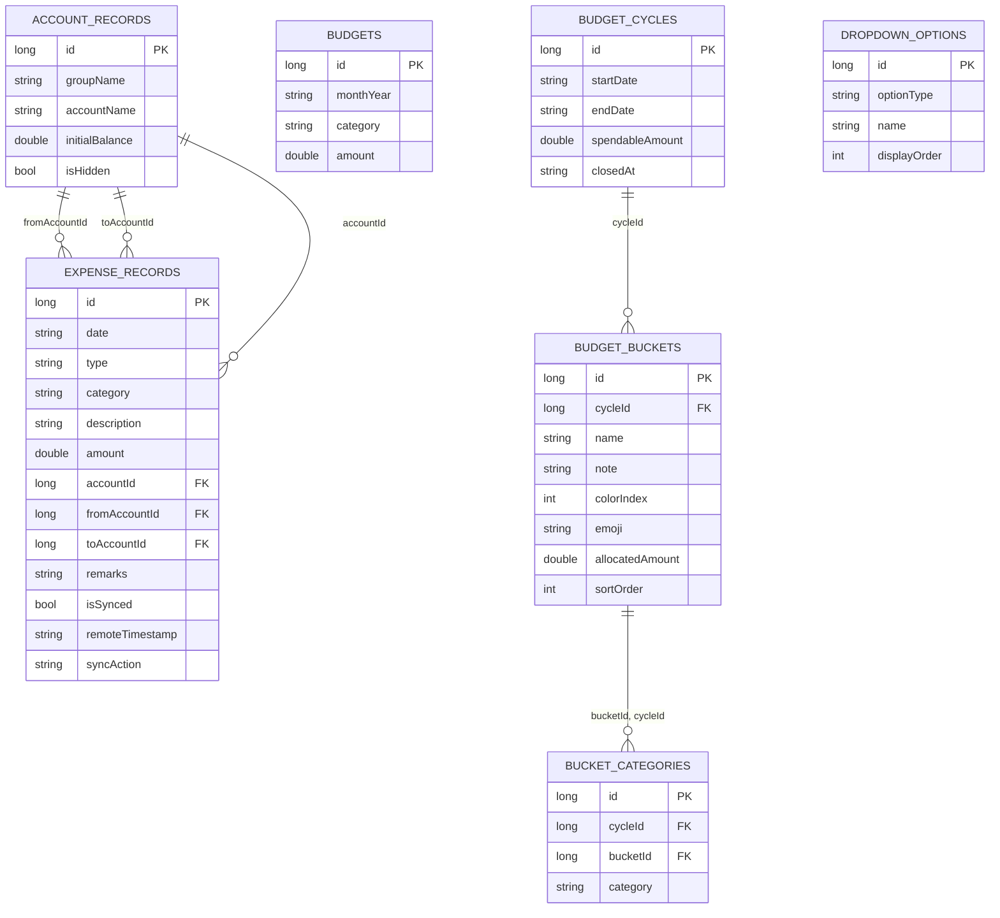
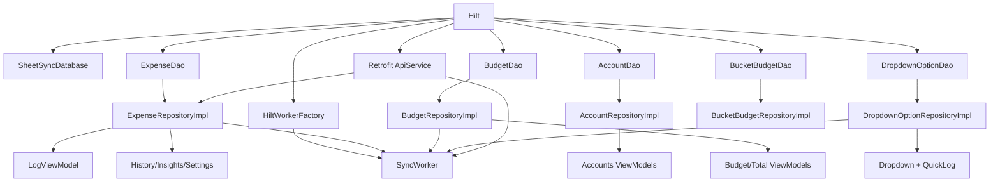

# SheetSync Architecture

This document describes the current architecture of the application, including module boundaries, runtime flows, sync behavior, and the Room database model.

## 1. High-Level Architecture

SheetSync follows an offline-first architecture:

- UI writes to local Room database immediately.
- ViewModels observe Room-backed Flows/StateFlows for reactive UI.
- WorkManager performs background synchronization to Google Apps Script.
- Google Apps Script persists/reads from Google Sheets.

```mermaid
graph TD
    U[User Interaction] --> UI[Jetpack Compose Screens]
    UI --> VM[ViewModels]
    VM --> REPO[Repositories]
    REPO --> ROOM[(Room Database)]

    VM --> WM[WorkManager Enqueue]
    WM --> SW[SyncWorker]
    SW --> API[Retrofit ApiService]
    API --> GAS[Google Apps Script Web App]
    GAS --> GS[(Google Sheets)]

    REPO --> API
    API --> REPO
    REPO --> VM
    VM --> UI
```

## 2. Layer Responsibilities

### Presentation Layer

- Built with Jetpack Compose + Navigation.
- Primary top-level destinations:
  - Trans (History: Daily, Calendar, Monthly)
  - Stats (Insights)
  - Budget (salary-cycle buckets; sub-screens: Start cycle, Plan buckets, Bucket detail)
  - Accounts
  - More (Settings)
- Form-heavy flows are managed in ViewModels with reactive state.

### Domain/Application Layer (Repository contracts)

- Repository interfaces abstract data operations.
- ViewModels depend on repositories, not DAOs.
- Business logic examples:
  - Duplicate detection during import
  - Budget aggregation and progress computation
  - Account running-balance calculations

### Data Layer

- Room as source of truth for:
  - expense_records
  - account_records
  - budgets
  - dropdown_options
- Retrofit handles:
  - Transaction sync (insert/update/delete)
  - Transaction import
  - Dropdown import
  - Budget import

### Background Execution

- WorkManager + Hilt-injected SyncWorker.
- SyncWorker sends local unsynced records and then backs up dropdowns, budgets and bucket budgets (cycles, buckets and category routing).
- Worker uses retry semantics on failure.

## 3. Navigation Architecture

```mermaid
flowchart TD
    A[App Start] --> B[Trans / History]
    A --> C[Stats / Insights]
    A --> BG[Budget]
    A --> D[Accounts]
    A --> E[More / Settings]

    B --> B1[Log Transaction]
    BG --> BG1[Start Cycle]
    BG --> BG2[Plan Buckets]
    BG --> BG3[Bucket Detail]

    D --> D1[Add Account]
    D --> D2[Account Detail]

    E --> E1[Dropdown Management]

    Q[Quick Surfaces] --> Q1[QuickLogActivity]
    Q[Quick Surfaces] --> Q2[Quick Settings Tile]
    Q[Quick Surfaces] --> Q3[Home Widget]
    Q[Quick Surfaces] --> Q4[App Shortcut]
```

## 4. Transaction Lifecycle

```mermaid
sequenceDiagram
    participant User
    participant LogScreen
    participant LogVM as LogViewModel
    participant Repo as ExpenseRepository
    participant Room as ExpenseDao/Room
    participant WM as WorkManager
    participant Worker as SyncWorker
    participant API as ApiService
    participant GAS as Apps Script
    participant Sheet as Google Sheets

    User->>LogScreen: Save transaction
    LogScreen->>LogVM: save()
    LogVM->>Repo: save/update(record, isSynced=false, syncAction=INSERT|UPDATE)
    Repo->>Room: insert/update
    Room-->>LogVM: local write complete
    LogVM->>WM: enqueue unique SyncWorker

    WM->>Worker: run doWork()
    Worker->>Repo: getUnsynced()
    Repo-->>Worker: unsynced records

    alt INSERT/UPDATE exists
        Worker->>API: syncRecords(action, records)
        API->>GAS: POST
        GAS->>Sheet: append/update rows
        GAS-->>API: ok
        API-->>Worker: ok
        Worker->>Repo: markSynced(ids)
    end

    alt DELETE exists
        Worker->>API: syncRecords(delete, targetTimestamp)
        API->>GAS: POST delete
        GAS->>Sheet: delete row by timestamp
        GAS-->>API: ok/not found
        Worker->>Repo: hardDeleteById(id)
    end

    Worker->>API: backup dropdowns
    Worker->>API: backup budgets
    Worker->>API: backup bucket_budgets
```

## 5. Import Flows

### Google Sheets Import

1. Settings triggers importFromSheets.
2. Repository imports dropdowns and overwrites local options.
3. Repository imports budgets and overwrites local budget rows.
3a. Repository imports bucket_budgets (cycles with nested buckets and categories) and replaces the local cycle tables.
4. Repository imports transactions and deduplicates against local comparable fields.

### CSV Import

1. Settings picks CSV file.
2. CsvParser parses header-based columns.
3. Records inserted via repository.
4. Optional duplicate skipping based on toggle.

## 6. Database Model (Room)

```mermaid
erDiagram
    ACCOUNT_RECORDS ||--o{ EXPENSE_RECORDS : fromAccountId
    ACCOUNT_RECORDS ||--o{ EXPENSE_RECORDS : toAccountId
    ACCOUNT_RECORDS ||--o{ EXPENSE_RECORDS : accountId

    ACCOUNT_RECORDS {
        long id PK
        string groupName
        string accountName
        double initialBalance
        bool isHidden
    }

    EXPENSE_RECORDS {
        long id PK
        string date
        string type
        string category
        string description
        double amount
        long accountId FK
        long fromAccountId FK
        long toAccountId FK
        string remarks
        bool isSynced
        string remoteTimestamp
        string syncAction
    }

    BUDGETS {
        long id PK
        string monthYear
        string category
        double amount
    }

    BUDGET_CYCLES ||--o{ BUDGET_BUCKETS : cycleId
    BUDGET_BUCKETS ||--o{ BUCKET_CATEGORIES : "bucketId, cycleId"

    BUDGET_CYCLES {
        long id PK
        string startDate
        string endDate
        double spendableAmount
        string closedAt
    }

    BUDGET_BUCKETS {
        long id PK
        long cycleId FK
        string name
        string note
        int colorIndex
        string emoji
        double allocatedAmount
        int sortOrder
    }

    BUCKET_CATEGORIES {
        long id PK
        long cycleId FK
        long bucketId FK
        string category
    }

    DROPDOWN_OPTIONS {
        long id PK
        string optionType
        string name
        int displayOrder
    }
```

## 7. Table-Level Details

### expense_records

- Purpose: transaction ledger and sync state tracking.
- Important behavior:
  - Soft delete for sync by setting syncAction=DELETE.
  - Hard delete after successful remote delete.
  - isSynced + syncAction drives worker behavior.

### account_records

- Purpose: logical accounts for transfer and balance calculations.
- Used by:
  - Account listing and detail statement screens.
  - Transfer transactions (fromAccountId/toAccountId).

### budgets

- Purpose: monthly budget configuration.
- Unique index: (monthYear, category).
- Includes both category-level entries and total-budget semantics from app logic.

### budget_cycles / budget_buckets / bucket_categories

- Purpose: salary-cycle bucket budgeting. A cycle is the money to spend between two paydays,
  a bucket is a named pot inside one cycle, and bucket_categories routes expense categories into buckets.
- A cycle with a null closedAt is the running one. It stays running past its endDate until the next
  cycle is started, so spend logged after payday is never orphaned.
- Buckets belong to a cycle (not shared across cycles), so a closed cycle is immutable history and
  "carry over" is a copy.
- One category per bucket is enforced by the unique index on bucket_categories (cycleId, category),
  which is case-insensitive (NOCASE) because category names are matched ignoring case elsewhere.
  The composite foreign key (bucketId, cycleId) -> budget_buckets(id, cycleId) keeps the repeated
  cycleId honest. Assigning uses REPLACE, so a category moves between buckets instead of duplicating.
- Categories with no row are "Unbucketed", a virtual bucket that is derived, never stored.
- Spent and remaining amounts are derived from expense_records over the cycle's date range, not stored.
- No per-row sync fields: like budgets, these are backed up wholesale rather than tracked per record.
- Cycle rules live in data/bucket/ as pure functions: CycleCalendar (day counts, pace, overdue),
  CycleSummaryBuilder (derives spend per bucket from expense_records), CycleTransitions (validation and the
  closing rule when a new cycle starts) and SalaryDetector. BucketBudgetRepository.startCycle runs the
  close-open-carry-over sequence in one Room transaction.
- v16 -> v17 migration (data/local/migration/BucketBudgetMigration.kt) creates the tables and seeds the
  first cycle from the most recent month in budgets. The budgets table itself is left untouched.

### Bucket budget sync (Google Sheets)

- Backed up wholesale on every sync and restored wholesale on import, like budgets. Stored in three
  sheets (`_cycles`, `_buckets`, `_bucket_categories`) but sent and returned as one nested list of
  cycles, each holding its buckets, each holding its category names, so a restore never re-links ids.
- Request: `{action: "backup", target: "bucket_budgets", records: [], cycles: [...]}`. Cycles travel in
  `cycles` and `records` stays empty on purpose: a script deployed before this target existed treats
  `records` as transactions and would append junk rows to the transaction sheet. With `records`
  empty that older script does nothing.
- The app trusts a reply only if it carries the new script's marker (`type: "bucket_budgets_backed_up"`
  for a backup, `type: "bucket_budgets"` for a fetch). Without it the app reports "script outdated" and
  carries on; an outdated script never fails the whole sync.
- Date and free-text columns are written as plain text so Sheets does not turn ISO dates into Date cells
  or parse notes and category names that start with `=` as formulas.
- Restore treats the sheet as untrusted (data/bucket/BucketBackup.kt): malformed cycles are dropped,
  categories are de-duplicated per cycle ignoring case, and at most one cycle can come back running.
  An empty or outdated sheet never wipes local cycles. On a device with no cycles, the restored monthly
  budgets are carried across as on upgrade.
- The script exists twice: `scripts/AppsScript.gs` and the copy in `AppsScriptSetupScreen.kt` that users
  paste in. `scripts/tests/bucket-budgets.test.js` runs both against a fake spreadsheet, in India and Los
  Angeles time zones, and fails if they drift. It also runs the pre-change script from
  `scripts/tests/fixtures/` to prove the compatibility above. `BucketBudgetContractTest` and the test
  share golden request/response files, so a field renamed on either side fails a test.

### dropdown_options

- Purpose: configurable app dictionaries.
- optionType values currently cover:
  - EXPENSE_CATEGORY
  - INCOME_CATEGORY
  - ACCOUNT_GROUP
  - PAYMENT_MODE

## 8. Dependency Injection Graph (Conceptual)

```mermaid
graph TD
    H[Hilt] --> DB[SheetSyncDatabase]
    H --> DAO1[ExpenseDao]
    H --> DAO2[AccountDao]
    H --> DAO3[BudgetDao]
    H --> DAO4[DropdownOptionDao]
    H --> DAO5[BucketBudgetDao]
    H --> NET[Retrofit ApiService]
    H --> WMF[HiltWorkerFactory]

    DAO1 --> R1[ExpenseRepositoryImpl]
    DAO2 --> R2[AccountRepositoryImpl]
    DAO3 --> R3[BudgetRepositoryImpl]
    DAO4 --> R4[DropdownOptionRepositoryImpl]
    DAO5 --> R5[BucketBudgetRepositoryImpl]
    NET --> R1

    R1 --> VM1[LogViewModel]
    R1 --> VM2[History/Insights/Settings]
    R2 --> VM3[Accounts ViewModels]
    R3 --> VM4[Budget/Total ViewModels]
    R4 --> VM5[Dropdown + QuickLog]

    WMF --> SW[SyncWorker]
    R1 --> SW
    R3 --> SW
    R4 --> SW
    NET --> SW
```

## 9. Operational Notes

- The app is intentionally resilient to intermittent connectivity due to local-first persistence + queued sync.
- Remote endpoint changes (Apps Script redeploy) require local `APPS_SCRIPT_URL` update.
- Sync includes not only transactions but also dropdown and budget backup to support restore scenarios.
