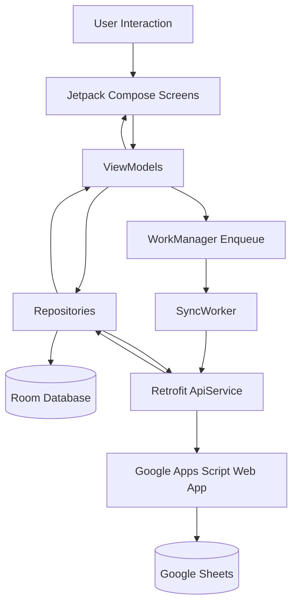
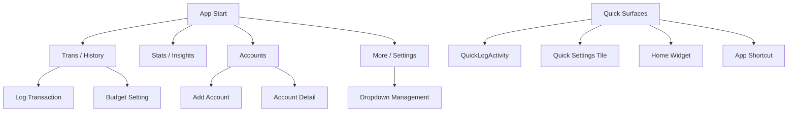
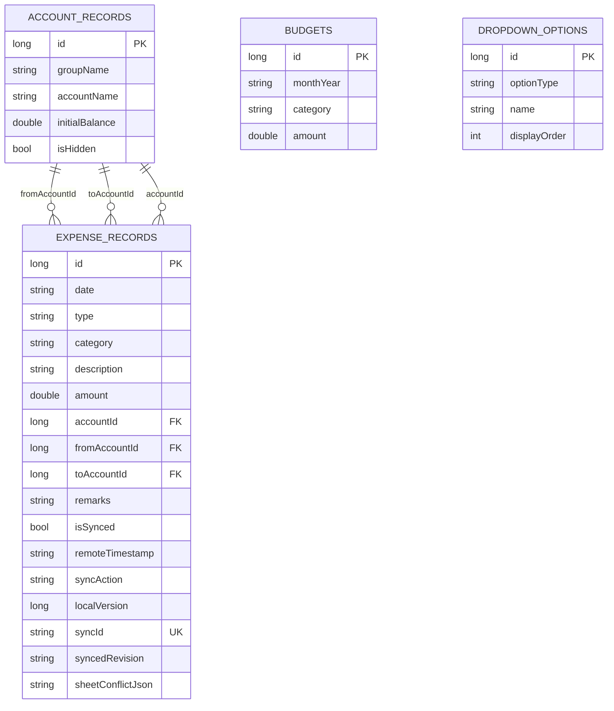
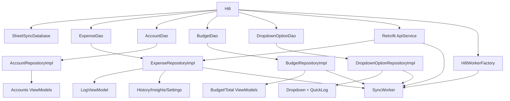

# SheetSync Architecture

This document describes the current architecture of the application, including module boundaries, runtime flows, sync behavior, and the Room database model.

## 1. High-Level Architecture

SheetSync follows an offline-first architecture:

- UI writes to local Room database immediately.
- ViewModels observe Room-backed Flows/StateFlows for reactive UI.
- WorkManager performs background synchronization to Google Apps Script.
- Google Apps Script persists/reads from Google Sheets.

```mermaid
graph TD
    U[User Interaction] --> UI[Jetpack Compose Screens]
    UI --> VM[ViewModels]
    VM --> REPO[Repositories]
    REPO --> ROOM[(Room Database)]

    VM --> WM[WorkManager Enqueue]
    WM --> SW[SyncWorker]
    SW --> API[Retrofit ApiService]
    API --> GAS[Google Apps Script Web App]
    GAS --> GS[(Google Sheets)]

    REPO --> API
    API --> REPO
    REPO --> VM
    VM --> UI
```

## 2. Layer Responsibilities

### Presentation Layer

- Built with Jetpack Compose + Navigation.
- Primary top-level destinations:
  - Trans (History: Daily, Calendar, Monthly, Total)
  - Stats (Insights)
  - Accounts
  - More (Settings)
- Form-heavy flows are managed in ViewModels with reactive state.

### Domain/Application Layer (Repository contracts)

- Repository interfaces abstract data operations.
- ViewModels depend on repositories, not DAOs.
- Business logic examples:
  - Duplicate detection during import
  - Budget aggregation and progress computation
  - Account running-balance calculations

### Data Layer

- Room as source of truth for:
  - expense_records
  - account_records
  - budgets
  - dropdown_options
- Retrofit handles:
  - Transaction sync (insert/update/delete)
  - Transaction import
  - Dropdown import
  - Budget import

### Background Execution

- `SyncTriggers` (started in `SheetSyncApp`) watches Room: any Transaction waiting to sync requests a Sync, and any change to accounts, dropdowns, budgets or transactions requests a Backup. Screens never schedule sync work. All work is queued through `SyncScheduler`. `SyncWorker` sends pending Transaction changes. It's queued with `APPEND_OR_REPLACE`, so a running Sync is never cancelled, and it retries with exponential backoff.
- `BackupWorker` replaces the Sheet's accounts, dropdowns and budgets tabs. It runs as a separate, delayed job, so a failing Backup can't hold Transactions back. Before a phone's first Backup, `SheetListsMerger` adds the Sheet's accounts, dropdowns and budgets that the phone lacks (matched by name), so a fresh install's defaults can never replace the Sheet's real lists.
- Sync is two-way and safe to repeat (ADR-0003). Every Transaction has a permanent Transaction ID (`syncId`, assigned by a Room trigger) shared with the Sheet's ID column. `TransactionSyncer` Pulls when needed (app open, "Sync now", rows without an ID yet, or after a stale refusal) and merges each ID three ways in `SheetMerge`, then Pushes pending changes as `upsert`/`delete_ids` by ID. Each upsert carries the row revision the phone last agreed on (`syncedRevision`), and the script refuses it as stale if the row changed since, so a Sheet edit is merged rather than overwritten. A Transaction is only settled if its `localVersion` (raised by a SQLite trigger on every change) hasn't moved since Sync read it.

## 3. Navigation Architecture

```mermaid
flowchart TD
    A[App Start] --> B[Trans / History]
    A --> C[Stats / Insights]
    A --> D[Accounts]
    A --> E[More / Settings]

    B --> B1[Log Transaction]
    B --> B2[Budget Setting]

    D --> D1[Add Account]
    D --> D2[Account Detail]

    E --> E1[Dropdown Management]

    Q[Quick Surfaces] --> Q1[QuickLogActivity]
    Q[Quick Surfaces] --> Q2[Quick Settings Tile]
    Q[Quick Surfaces] --> Q3[Home Widget]
    Q[Quick Surfaces] --> Q4[App Shortcut]
```

## 4. Transaction Lifecycle

```mermaid
sequenceDiagram
    participant User
    participant LogScreen
    participant LogVM as LogViewModel
    participant Repo as ExpenseRepository
    participant Room as ExpenseDao/Room
    participant WM as WorkManager
    participant Worker as SyncWorker
    participant API as ApiService
    participant GAS as Apps Script
    participant Sheet as Google Sheets

    User->>LogScreen: Save transaction
    LogScreen->>LogVM: save()
    LogVM->>Repo: save/update(record, isSynced=false, syncAction=INSERT|UPDATE)
    Repo->>Room: insert/update
    Room-->>LogVM: local write complete
    Room-->>WM: SyncTriggers sees the unsynced row → SyncScheduler.requestSync() (APPEND_OR_REPLACE; a delayed BackupWorker too)

    WM->>Worker: run doWork()

    opt Pull (app open, Sync now, unlinked rows)
        Worker->>API: importRecords(transactions)
        API->>GAS: GET (under lock: assign missing IDs)
        GAS-->>Worker: rows with id + revision, scriptVersion 2
        Worker->>Room: apply SheetMerge steps (version-checked, one Room transaction)
    end

    alt pending INSERT/UPDATE (batches of 50)
        Worker->>API: syncRecords(upsert, transactions with base revision)
        API->>GAS: POST (under lock)
        GAS->>Sheet: overwrite row with that ID, or append; refuse rows changed since base
        GAS-->>Worker: ok, revisions, stale
        Worker->>Room: markSyncedIfUnchanged(id, localVersion, revision)
        opt any stale
            Worker->>API: Pull and merge (conflict or settle)
        end
    end

    alt pending DELETE
        Worker->>API: syncRecords(delete_ids, ids)
        GAS->>Sheet: delete rows by ID (missing = already gone)
        Worker->>Room: finishDeleteIfUnchanged(id, localVersion)
    end
```

## 5. Import Flows

### Google Sheets Import

1. Settings triggers importFromSheets.
2. Repository imports dropdowns, accounts and budgets and overwrites the local lists.
3. Transactions come in through the same Pull as every Sync (`TransactionSyncer`), merged by Transaction ID; conflicts appear in Settings.

### CSV Import

1. Settings picks CSV file.
2. CsvParser parses header-based columns.
3. Records inserted via repository.
4. Optional duplicate skipping based on toggle.

## 6. Database Model (Room)

```mermaid
erDiagram
    ACCOUNT_RECORDS ||--o{ EXPENSE_RECORDS : fromAccountId
    ACCOUNT_RECORDS ||--o{ EXPENSE_RECORDS : toAccountId
    ACCOUNT_RECORDS ||--o{ EXPENSE_RECORDS : accountId

    ACCOUNT_RECORDS {
        long id PK
        string groupName
        string accountName
        double initialBalance
        bool isHidden
    }

    EXPENSE_RECORDS {
        long id PK
        string date
        string type
        string category
        string description
        double amount
        long accountId FK
        long fromAccountId FK
        long toAccountId FK
        string remarks
        bool isSynced
        string remoteTimestamp
        string syncAction
        long localVersion
        string syncId UK
        string syncedRevision
        string sheetConflictJson
    }

    BUDGETS {
        long id PK
        string monthYear
        string category
        double amount
    }

    DROPDOWN_OPTIONS {
        long id PK
        string optionType
        string name
        int displayOrder
    }
```

## 7. Table-Level Details

### expense_records

- Purpose: transaction ledger and sync state tracking.
- Important behavior:
  - Soft delete for sync by setting syncAction=DELETE.
  - Hard delete after successful remote delete.
  - isSynced + syncAction drives worker behavior.
  - Triggers: `localVersion` rises on every change; a Transaction inserted unsynced gets a `syncId`.
  - `syncedRevision` is the Sheet row revision both sides last agreed on; `sheetConflictJson` holds the Sheet's version while in a Sync conflict.

### account_records

- Purpose: logical accounts for transfer and balance calculations.
- Used by:
  - Account listing and detail statement screens.
  - Transfer transactions (fromAccountId/toAccountId).

### budgets

- Purpose: monthly budget configuration.
- Unique index: (monthYear, category).
- Includes both category-level entries and total-budget semantics from app logic.

### dropdown_options

- Purpose: configurable app dictionaries.
- optionType values currently cover:
  - EXPENSE_CATEGORY
  - INCOME_CATEGORY
  - ACCOUNT_GROUP
  - PAYMENT_MODE

## 8. Dependency Injection Graph (Conceptual)

```mermaid
graph TD
    H[Hilt] --> DB[SheetSyncDatabase]
    H --> DAO1[ExpenseDao]
    H --> DAO2[AccountDao]
    H --> DAO3[BudgetDao]
    H --> DAO4[DropdownOptionDao]
    H --> NET[Retrofit ApiService]
    H --> WMF[HiltWorkerFactory]

    DAO1 --> R1[ExpenseRepositoryImpl]
    DAO2 --> R2[AccountRepositoryImpl]
    DAO3 --> R3[BudgetRepositoryImpl]
    DAO4 --> R4[DropdownOptionRepositoryImpl]
    NET --> R1

    R1 --> VM1[LogViewModel]
    R1 --> VM2[History/Insights/Settings]
    R2 --> VM3[Accounts ViewModels]
    R3 --> VM4[Budget/Total ViewModels]
    R4 --> VM5[Dropdown + QuickLog]

    WMF --> SW[SyncWorker]
    R1 --> SW
    R3 --> SW
    R4 --> SW
    NET --> SW
```

## 9. Operational Notes

- The app is intentionally resilient to intermittent connectivity due to local-first persistence + queued sync.
- Remote endpoint changes (Apps Script redeploy) require pasting the new URL into Database Setup (Sheets).
- Sync includes not only transactions but also dropdown and budget backup to support restore scenarios.
