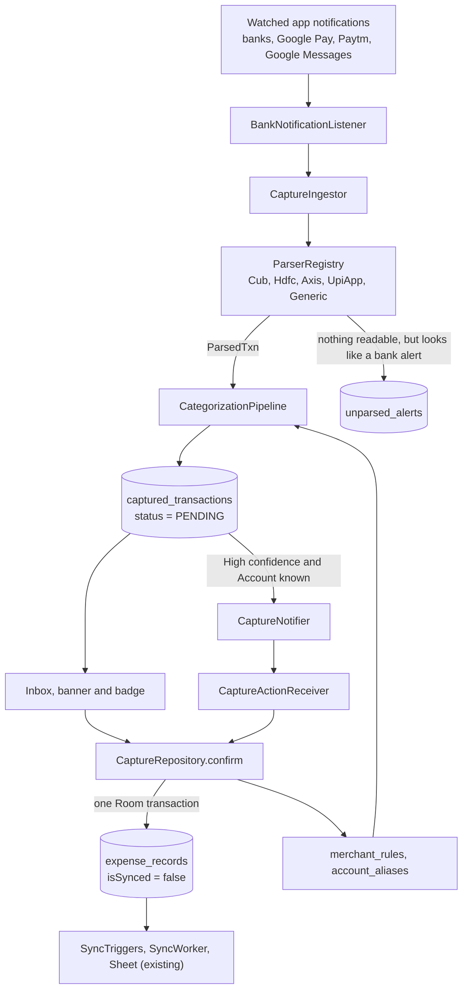

# Auto-capture

Auto-capture turns bank and UPI alerts into suggested Transactions, so they don't have to be typed in by
hand. Everything runs on the phone with plain code: no network calls, no paid services, no machine-learning
model.

Nothing becomes a Transaction until the user confirms it ([ADR-0004](adr/0004-auto-capture-never-confirms-itself.md)).
Alerts are read from notifications, not from the SMS database ([ADR-0006](adr/0006-auto-capture-reads-notifications-not-sms.md)).

Terms used here (Captured transaction, Confirm, Merchant rule, Account alias, Confidence band, Unparsed
alert) are defined in [CONTEXT.md](../CONTEXT.md).

## 1. What the user sees

1. **Turn it on** in More > Auto-capture: switch capture on, grant notification access (an Android system
   screen), and allow notifications so confirmations can be asked from a notification.
2. **Map categories once.** The app recognises kinds of merchant (food delivery, groceries, fuel and so on)
   but only ever files into the user's own Categories. The same screen matches each kind to one of them. A
   kind left unmapped shows "Needs a category".
3. **Alerts arrive.** Each one from a watched app becomes a pending capture. A banner on the Trans screen
   ("3 captured transactions to review") and a badge on the Trans tab count them.
4. **Review.** The inbox shows, per capture: merchant, exact amount, account number, the date (if the alert
   states one), the guessed Category and Account, and why it was guessed. The user picks a Category and
   Account where missing, then **Confirm** or **Dismiss**. "Original text" shows the alert as received.
   "Always use X for Y" saves a rule after one confirmation.
5. **Confirm from a notification.** A capture that is High confidence and has a known Account also posts a
   notification with **Confirm** and **Not mine**. Everything else waits quietly in the inbox.
6. **Unreadable alerts.** If a bank changes its wording and an alert can't be read, it appears under
   More > Auto-capture > Alerts we couldn't read, with Copy and Delete.

## 2. How it fits together

Confirm is the only way a capture becomes a Transaction. It writes exactly what a manual entry writes, an
unsynced `ExpenseRecord`, so the existing Sync picks it up unchanged (ADR-0001, ADR-0003). Captures, rules,
aliases and unparsed alerts are local only and are not sent to the Sheet.

### Package map (`com.issaczerubbabel.ledgar`)

| Area | Files |
| --- | --- |
| `capture/source` | `BankNotificationListener` (the service), `CaptureApps` (the allowlist and sender rules) |
| `capture` | `CaptureIngestor` (parse, dedupe, account lookup, categorize, store), `CaptureSettingsSource` |
| `capture/parse` | `ParserRegistry`, `HdfcParser`, `CubParser`, `AxisParser`, `UpiAppParser`, `GenericBankParser`, `ParsingUtils`, `ParsedTxn`, `TxnTime` |
| `capture/categorize` | `MerchantNormalizer`, `KeywordDictionary`, `CategoryResolver`, `CategorizationPipeline`, `MerchantRuleLearner` |
| `capture/notify` | `CaptureNotifier`, `CaptureActionReceiver`, `CaptureActionHandler`, `CaptureNotificationText` |
| `data/local` | entities `CapturedTransaction`, `MerchantRule`, `AccountAlias`, `UnparsedAlert`; matching DAOs; `CaptureMigration` (v18 to v19, v19 to v20) |
| `data` | `CaptureRepository(Impl)`, `CapturePreferencesRepository` (on/off flag and category mapping, in DataStore) |
| `viewmodel`, `ui/screens` | `ReviewInboxViewModel` + `CaptureInboxScreen`, `CaptureSettingsViewModel` + `CaptureSettingsScreen`, `UnparsedAlertsViewModel` + `UnparsedAlertsScreen`, `CaptureBadgeViewModel` |
| `di` | `CaptureModule` (keyword list from `assets/merchant_keywords.json`, the pipeline, bindings) |

## 3. Reading the alerts

**Which apps.** `CaptureApps` holds the allowlist: HDFC (`com.hdfcbank.android.now`), Axis
(`com.axis.mobile`), City Union Bank (`com.cub.plus.gui`), Google Pay
(`com.google.android.apps.nbu.paisa.user`), Paytm (`net.one97.paytm`) and Google Messages
(`com.google.android.apps.messaging`). Bank SMS arrive through the Messages notification, so the SMS
permission is never needed. Notifications from any other app are never read. Debug builds also accept the
adb shell (see section 11); release builds never do.

**What is read.** The notification's title and big text. For a bank or UPI app the app names itself as the
sender; for Messages the notification title is the sender (an ID like `AD-HDFCBK-T`).

**When.** Live, through `onNotificationPosted`, and once on `onListenerConnected` for notifications already in
the shade. The second matters because Android can stop the service or access can be off for a while, and
those alerts would otherwise be lost. Repeats are harmless (section 5).

**Arrival time** is the notification's own post time, not "now". Re-reading the shade must give an alert the
same time, or it would be captured a second time.

## 4. Parsing

`ParserRegistry` tries parsers in order and uses the first that claims the text: City Union Bank, HDFC,
Axis, UPI apps, then a generic fallback. Each returns a `ParsedTxn` (amount, direction, merchant, account
digits, reference, channel, and the alert's date if stated).

Formats covered by tests built from real (redacted) alerts:

| Parser | Formats |
| --- | --- |
| HDFC | UPI send (`Sent Rs.70.00 From HDFC Bank A/C *1234 To Name On 26/09/26 Ref ...`); UPI ATM withdrawal; deposit narration (`INR ... deposited in HDFC Bank A/c XX1234 on 25-SEP-26 for PAYER CREDIT`) |
| City Union Bank | `Your a/c no. XXXXXXXX1234 is credited/debited for Rs.X on 14-09-2026 and debited from/credited to a/c no. ... (UPI Ref no ...)`. Direction is always about "Your a/c"; the other account is only a counterparty hint |
| Axis | UPI merchant debit, recognised by its `UPI/P2M/<ref>/<merchant>` narration because it never says "Axis"; IMPS credit |
| Google Pay | `Paid Rs.500 to NAME.` and `Received ... from NAME.` Built from a description of the notifications, **not** a capture from a real phone |
| Paytm | Same patterns as Google Pay on trust. No sample exists yet |
| Generic | Any text with an amount and a debit or credit word |

Rules common to all: OTP messages are rejected; the first amount in the text is the transaction (balances
come later); the dates `26/09/26`, `25-SEP-26`, `14-09-2026` and `19-12-24` are all read, day first.

**Adding a bank.** Add a `TransactionParser` with `canParse` (cheap) and `parse`, list it in
`ParserRegistry.default()` before the generic parser, and add a test file using the real alert text. Keep
the alerts in tests, since they are the only record of what a bank actually sends. Expect gaps: a
VPA-addressed debit ("to VPA merchant@bank") has no sample yet, so its merchant comes back empty.

## 5. Keeping one capture per alert

Each capture has a `rawHash` with a unique index; a repeat is dropped by the database.

- Alert **with a reference number**: the hash is of source, sender and the alert text. The reference makes
  each payment's text unique.
- Alert **without one** (Google Pay): the hash also includes the ten-minute window of the post time. The
  same notification read again gets the same key, while two real identical payments more than ten minutes
  apart both land. Two identical payments within ten minutes count as one; nothing in the alert can tell
  them apart.

**Dating.** A capture is filed under the date its alert states (`TxnTime`), so a late SMS isn't logged as
today. A missing date, an impossible one, or one more than a day in the future falls back to arrival time. A
past date keeps the arrival's time of day. The inbox shows the alert's date when it differs from the
arrival day, and lists what arrived last first.

## 6. Categorizing

The Merchant name is normalised first (`MerchantNormalizer`): a UPI handle loses its domain, digits,
punctuation and company words are dropped, and a phone-number handle becomes `P2P:<number>`. Then:

| Rule | When | Confidence |
| --- | --- | --- |
| R1 | A saved Merchant rule exists for the merchant and type | 0.98 |
| R7 | A keyword matches and its kind is mapped to a Category the user still has | 0.75 |
| R11 | Anything else: "Needs a category" | none |

- **Keywords** come from `assets/merchant_keywords.json` (kind to words). Whole words only, the longest
  match wins, so "instamart" beats "swiggy" for `SWIGGY INSTAMART`.
- **The app never invents a Category.** A kind with no mapping, or mapped to a Category since deleted,
  leaves the capture uncategorized and records which kind to map. Mapping a kind in Settings fills in waiting
  captures that were only missing it; it never changes one already suggested or chosen.
- **Credits** are Income and only ever get a Category from a rule.
- **Bands.** High is 0.90 or more, Check is 0.60 to 0.89, Low is less or no Category. Only a rule reaches
  High, so a keyword guess is always Check.

**Merchant rules** (`MerchantRuleLearner`), keyed by merchant and type:

| Origin | How it arises | What happens to it |
| --- | --- | --- |
| `CANDIDATE` | First confirmation of a merchant | Tracks consecutive same-category confirmations. Never matched |
| `LEARNED` | Three same-category confirmations in a row | Deleted after two overrides in a row |
| `USER` | "Always use X for Y" ticked on Confirm | Never changed automatically |

Confirming from a notification or in bulk never saves a `USER` rule.

## 7. Accounts

An **Account alias** maps the account digits in an alert (`1234`) to one of the user's Accounts. There is no
prompt: a capture with an unknown number shows "Map account". Picking an Account for it and confirming saves
the alias, and other waiting captures with that number pick the Account up too. Aliases are by last digits
only; UPI-address aliases are not built.

## 8. The notification

`CaptureNotifier` posts for a capture that is High confidence **and** has a known Account, nothing else.

- The lock screen shows "A captured transaction is waiting"; the amount and merchant appear only once unlocked.
- **Confirm** is marked as needing authentication (`setAuthenticationRequired`), so Android asks for an unlock
  first. It saves only what the capture
  already suggests; with no Category or Account it does nothing and the capture stays in the inbox.
- **Not mine** dismisses the capture.
- Tapping the notification opens the app normally, so the app lock still applies before anything is shown.
- It is cancelled when the capture is resolved in the inbox.

## 9. Unparsed alerts

An alert no parser could read is kept only if it comes from a watched app or a bank-style SMS sender ID
(`AB-BANKID` or `AB-BANKID-S`), shows an amount, and is not an OTP. A friend's message, an alert with no amount
and an OTP are never stored. Entries are deleted after 30 days and when capture is turned off. A promotional
SMS from a bank-style sender that shows an amount is also kept, since it can't be told apart from a
wording change; "Clear all" deals with those.

## 10. Data and privacy

| Table | Holds | Sent to the Sheet |
| --- | --- | --- |
| `captured_transactions` | Waiting and resolved captures, including the alert's text | No |
| `merchant_rules` | Saved and learned rules | No |
| `account_aliases` | Account digits to Account | No |
| `unparsed_alerts` | Unreadable alerts, 30 days | No |

- Only allowlisted apps are read, and a notification's text is never logged.
- Turning capture off clears waiting captures and unparsed alerts. Rules, aliases and the category mapping
  are kept.
- All processing is on the device.

## 11. Testing

- **Unit tests** (`./gradlew test`) cover the parsers against real alert text, the normaliser, keywords,
  categorization, rule learning, dates and the notification text. At the time of writing: 204.
- **Device tests** (`./gradlew connectedDebugAndroidTest`) run the real flow against SQLite and the real
  notification: ingest, confirm, learn, dedupe, dating, unparsed alerts, and the notification's actions and
  privacy. At the time of writing: 54. Gradle's runner uninstalls the debug app afterwards, which also
  deletes its data. To keep the data, install both APKs and run
  `adb shell am instrument -w <package>.debug.test/androidx.test.runner.AndroidJUnitRunner`.
- **Trying it without a payment** (debug builds only): post a notification as the adb shell, for example
  `adb shell "cmd notification post -S bigtext -t 'HDFC' tag 'Sent Rs.70.00 From HDFC Bank A/C *1234 To Shop On 26/09/26 Ref 11111111111'"`.
  For a shell post the title is the sender, so use a bank-style ID such as `AD-HDFCBK-T` to try the
  unparsed-alerts list, or `Google Pay` for that parser. Grant access with
  `adb shell cmd notification allow_listener <package>/com.issaczerubbabel.ledgar.capture.source.BankNotificationListener`.
- **Release check.** Release builds use R8, which once broke capture. Gson's `TypeToken` needs the generic
  signature of its anonymous subclass, R8 strips it, and the notification listener then crashed on start
  with "TypeToken must be created with a type argument". It happens only in release, so debug tests cannot
  see it. `app/proguard-rules.pro` now keeps `TypeToken` and its subclasses. Before releasing, run
  `./gradlew assembleRelease --init-script scripts/release-check.init.gradle`. That builds the same release
  code as a separate app (`.relcheck`, signed with the debug key) that can be installed beside the real one.
  Open Auto-capture, switch capture on and confirm it doesn't crash. Never install a capture build over the
  real app without meaning to: it upgrades the real database.

## 12. Known limits and not built

Deliberate omissions and gaps, so nobody assumes otherwise:

- **Google Pay and Paytm are unverified.** Google Pay's layout comes from a description, and Paytm has no
  sample.
- **Sources.** Only notifications. No SMS permission path, no email capture.
- **Categorization.** Only rules and keywords. Matching against the user's history and a Naive Bayes
  classifier were planned and are not built, so a merchant seen before but with no rule still needs a
  Category.
- **Transfers.** Two captures are never merged into a Transfer suggestion
  ([ADR-0005](adr/0005-transfer-suggestions-require-an-own-account-signal.md) records how it should work).
- **No 30-day purge of a capture's raw text** (only unparsed alerts are purged). The database is not
  excluded from Android's automatic backup, which is on for the app.
- **Learned data is local.** Rules, aliases and the mapping aren't backed up to the Sheet, so a reinstall
  starts them again.
- **Late or dismissed alerts.** An alert dismissed from the shade before access was on is gone. Only Google
  Messages is watched for SMS; another messaging app would have to be added to `CaptureApps`.
- **Locked-phone behaviour wasn't exercised on hardware.** Every on-phone check of the notification's buttons
  was done with the phone unlocked. The unlock requirement and the generic lock-screen text come from how the
  notification is built, which a device test inspects, but nobody has watched Android enforce them.
- **Phone makers** that aggressively stop background services can stop the listener. Reconnecting re-reads the shade,
  which recovers what is still there.
